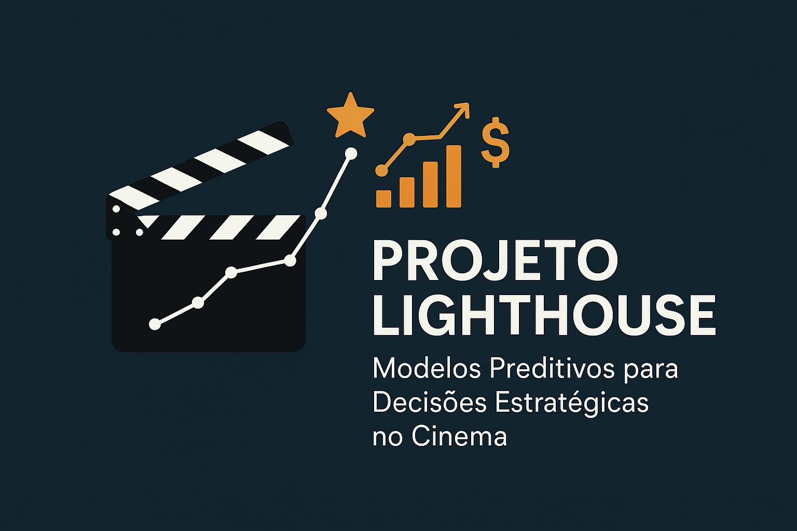

# Projeto Lighthouse – Ciência de Dados no Setor Cinematográfico

## Descrição do Problema de Negócio
O estúdio PProductions, de Hollywood, enfrenta um desafio estratégico: decidir qual será o próximo filme a ser produzido em um mercado altamente competitivo e de alto investimento. A escolha errada pode significar milhões em prejuízo, enquanto uma decisão bem-informada pode gerar grande retorno financeiro.

Para isso, o estúdio busca apoio no time de Ciência de Dados da Indicium, com o objetivo de:

        1. Entender os fatores que mais impactam o sucesso de um filme;
          
        2. Prever a nota de audiência (IMDb Rating);
          
        3. Analisar a relação entre características do filme (gênero, elenco, direção, sinopse, etc.) e o faturamento;
          
        4. Testar a possibilidade de inferir gêneros a partir de sinopses com NLP;
          
        5. Construir protótipos de recomendação de filmes.

O desafio envolve análise exploratória, modelagem preditiva e criatividade na formulação de hipóteses, sempre com foco em traduzir resultados técnicos para valor de negócio.

## Solução Estratégica Adotada

Desenvolvemos um conjunto de análises e modelos de Machine Learning para apoiar decisões de investimento em filmes. A estratégia é iterativa e prioriza entregas rápidas que possam gerar insights mesmo em um dataset limitado.

**Etapas do projeto:**

1. **Entendimento do Negócio:** Nesta etapa, desenvolvemos o entendimento do modelo de negócio de um estúdio de cinema, através de análise SWOT, Porter e Business Model Canvas para contextualizar o mercado da PProductions.

2. **Problema de Negócio:** Nesta etapa, definimos o problema do negócio de maneira clara e objetiva, focando nas soluções das perguntas-chave, através da análise dos dados.

3. **Coleta de Dados:** Nesta etapa, utilizamos o dataset inicial fornecido pela empresa, com aproximadamente 1000 filmes, e buscamos enriquecimento dele com datasets de fontes externas (Kaggle, APIs, dados sintéticos).
   
4. **Análise Descritiva:** Nesta etapa, utilizamos estatísticas descritivas para avaliar distribuições dos dados, analisamos os outliers e valores ausentes.
   
5. **Limpeza e Prepração dos Dados:** Nesta etapa, transformamos e aprimoramos dos dados brutos obtidos para torná-los adequados para análise e modelagem.

6. **Análise Exploratória de Dados (EDA):** Nesta etapa, exploramos os dados para encontrar insights e as características que melhor descrevem o fenômeno.

7. **Modelagem Preditiva:** Nesta etapa, estruturamos e fornecemos informações relevantes para os algoritmos de aprendizado.

8. **Treinamento dos Algoritmos de Machine Learning:** Nesta etapa, treinamos os modelos de aprendizado de máquina.

9. **Fine Tuning:** Nesta etapa, encontramos os melhores valores para cada parâmetro dos Modelos selecionados.

10. **Avaliação do Modelo:** Nesta etapa, medimos a performance do modelo utilizando métricas como o	IMDb Rating: RMSE < 0,5 e R² > 0,6. Gênero (NLP): F1-Score Macro > 0,6. Recomendação: cobertura > 50% e precisão simulada > 0,6. 

11. **Deploy e Interpretação:** Nesta etapa, traduzimos os resultados dos modelos em valores de negócios, criando um relatório exploratório com hipóteses e insights e, um arquivo .pkl com o melhor modelo treinado. 

## Base de Dados

O dataset inicial foi disponibilizado pelo time da Lighthouse e contém 1000 filmes e 15 variáveis. Além dos dados fornecidos, ....
